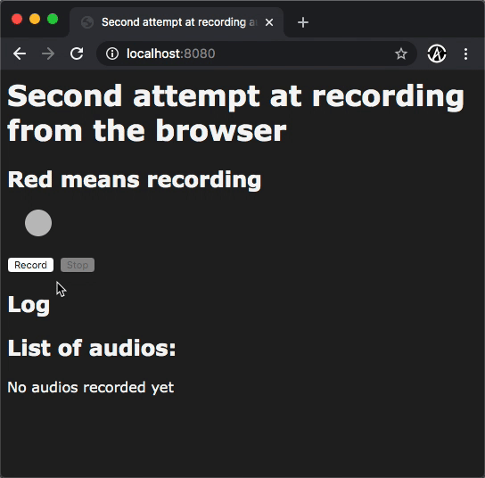

# Record mp3

This is the version where we record `.mp3` files.

An external library had to be brought in. namely: [`web-audio-recorder-js`](https://github.com/higuma/web-audio-recorder-js)

Right now you can record and download your recordings locally.

